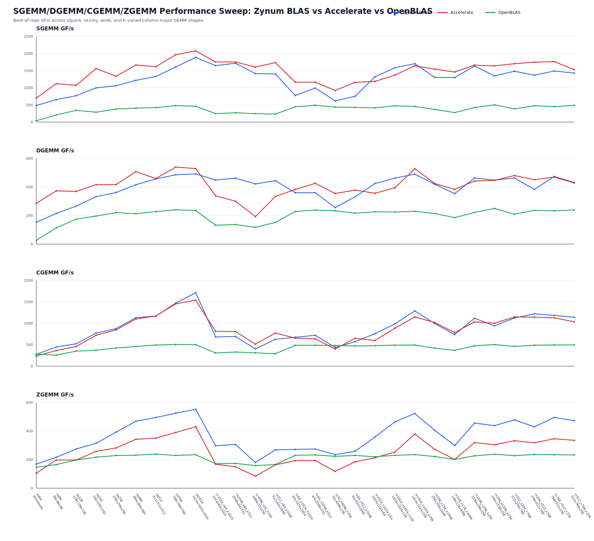

# Zynum

> **Zig-native numerical runtime with full BLAS compatibility, C/Fortran ABI entry points, typed vector/matrix views, and aggressively optimized GEMM paths for selected modern CPUs.**

[](https://ziglang.org/)
[](CHANGELOG.md)
[](https://netlib.org/blas/)
[](docs/fortran_compatibility.md)
[](#stability)
[](LICENSE)

**Repository:** <https://github.com/kaix-huang/Zynum>

Zynum is a `0.0.1-beta` numerical computing project. The current shipping module
is **Zynum BLAS** (`zynum-blas`): a full BLAS Level 1, Level 2, and Level 3
implementation with a Zig-first API, standard CBLAS/Fortran ABI symbols,
generated C/Fortran compatibility files, examples, tests, benchmarks, and
architecture-aware GEMM kernels.

The active `0.1.x` development line is focused on finishing the complete BLAS
surface and making performance competitive with vendor BLAS libraries. Its
primary native performance gate is Apple's latest production silicon: the 0.1
target is to beat Accelerate across the documented BLAS benchmark suite with
fresh-process evidence. This is an engineering target, not a blanket performance
claim for the current checkout.

The long-term direction is broader than BLAS: Zynum is designed to grow into a
single C/Fortran-compatible, Zig-native numerical runtime spanning dense linear
algebra, LAPACK-style decompositions, FFT, sparse kernels, CNN kernels, and
Transformer workloads across portable and architecture-specific CPU kernels.



<sub>Exploratory local snapshot: Apple M5/macOS, Zig 0.16.0,
`--release=fast -Dcpu=apple_m4+sme2p1` because this Zig version does not yet
name Apple M5 directly; SGEMM/DGEMM/CGEMM/ZGEMM default shape sweep, isolated
comparator processes, `reps=30`, `process-repeats=2`, default comparator thread
settings. Treat this as a quick visual performance signal, not a portable
performance guarantee. See `docs/common/benchmarking.md` before quoting
benchmark numbers.</sub>

## Highlights

| Area | What Zynum provides today |
| --- | --- |
| Zig-native API | Typed `Vector` and `Matrix` views, checked dimensions in safe builds, descriptive operations such as `matrixMultiply`, `matrixVectorMultiply`, `addScaledVector`, and `scaleVectorInto`. |
| Full BLAS coverage | BLAS Level 1, Level 2, and Level 3 compatibility through portable reference implementations and ABI wrappers. |
| C/Fortran compatibility | Standard symbols such as `dgemm_`, `zaxpy_`, `cblas_dgemm`, and `cblas_zdotc_sub`; generated `blas.h`, `cblas.h`, and `blas.f90`. |
| GEMM optimization | Portable backend plus selected AArch64 and x86_64 fast paths, feature-aware dispatch, task splitting, packing, threading experiments, and benchmark tooling. |
| Reproducibility | CI checks, generated-header drift detection, compatibility tests, example smoke tests, benchmark methodology docs, and isolated comparator runners. |
| Future stack | Project layout reserves clean module boundaries for LAPACK, FFT, sparse, CNN, Transformer, tensor, and random-number modules. |

## 0.1.x Target

The `0.1.x` line is scoped to Zynum BLAS:

- Complete every BLAS Level 1, Level 2, and Level 3 routine across real and
  complex types, including CBLAS, Fortran ABI, generated C headers, and generated
  Fortran module declarations.
- Support ARM and x86 CPUs through portable fallbacks and feature-aware kernels
  for AArch64 ASIMD/SVE/SVE2/AMX/SME and x86_64 SSE/AVX/AVX2/AVX512 tiers.
- Use the latest Apple Silicon machines as the primary performance gate, with
  the goal that Zynum beats Accelerate across the documented BLAS benchmark
  suite before 0.1 is considered complete.
- Keep performance claims tied to reproducible benchmark commands, CSV artifacts,
  thread counts, target features, and fresh-process comparator isolation.

## Current Module Matrix

| Module | Status | Scope |
| --- | --- | --- |
| `zynum` | Active | Top-level package facade for current and future numerical modules. |
| `zynum-blas` | Beta | Full BLAS Level 1-3 API, typed Zig views, compatibility ABI, kernels, tests, examples, and benchmarks. |
| `zynum-lapack` | Planned | Dense factorizations, solvers, eigenvalue/SVD routines, and LAPACK-compatible entry points. |
| `zynum-fft` | Planned | FFT routines and compatibility layers. |
| `zynum-sparse` | Planned | Sparse storage, sparse BLAS, and solver-oriented kernels. |
| `zynum-cnn` | Planned | Convolution and neural-network kernels. |
| `zynum-transformer` | Planned | Attention, matmul, normalization, and transformer primitives. |

## Requirements

- Zig 0.16.0 or newer in the 0.16 series.
- Optional: `gfortran` for the Fortran module smoke test and Fortran examples.
- Optional: Accelerate, OpenBLAS, or MKL for comparator benchmarks.
- Optional: Python 3 for benchmark plotting and isolated benchmark helpers.

## Quick Start

From a checkout of this repository:

```sh
zig build test
zig build
zig build generate-headers
zig fmt --check build.zig build.zig.zon src test bench examples tools
```

Build artifacts are installed under `zig-out/` by default:

- `zig-out/lib/libzynum_blas.dylib`, `libzynum_blas.so`, or platform equivalent.
- `zig-out/lib/libzynum_blas.a`.
- `zig-out/include/zynum/blas/cblas.h`.
- `zig-out/include/zynum/blas/blas.h`.
- `zig-out/include/zynum/blas/blas.f90`.

Use Zig's standard install options if you want a different prefix:

```sh
zig build --prefix /tmp/zynum-install
```

Compatibility headers and the Fortran module are installed by default. Disable
that installation when you only need Zig package and library artifacts:

```sh
zig build -Dcompat-headers=false
```

## Use Zynum From Zig

During beta development, a local path dependency is the simplest way to try
Zynum from another Zig project.

In the consuming project's `build.zig.zon`:

```zig
.dependencies = .{
    .zynum = .{
        .path = "../Zynum",
    },
},
```

In the consuming project's `build.zig`:

```zig
const std = @import("std");

pub fn build(b: *std.Build) void {
    const target = b.standardTargetOptions(.{});
    const optimize = b.standardOptimizeOption(.{});

    const zynum_dep = b.dependency("zynum", .{
        .target = target,
        .optimize = optimize,
    });

    const exe = b.addExecutable(.{
        .name = "app",
        .root_module = b.createModule(.{
            .root_source_file = b.path("src/main.zig"),
            .target = target,
            .optimize = optimize,
            .imports = &.{
                .{ .name = "zynum", .module = zynum_dep.module("zynum") },
            },
        }),
    });

    b.installArtifact(exe);
}
```

Use the top-level facade for normal Zig code:

```zig
const zynum = @import("zynum");
const blas = zynum.blas;
```

Consumers that only want the BLAS submodule can import `zynum-blas` instead
when their build file exposes that module:

```zig
.imports = &.{
    .{ .name = "zynum-blas", .module = zynum_dep.module("zynum-blas") },
},
```

## Typed Vector And Matrix Views

The Zig API uses typed views instead of raw BLAS argument lists. Views validate
shape, storage, strides, and unsupported aliasing in Debug, ReleaseSafe, and
ReleaseSmall builds; ReleaseFast removes those checks.

```zig
const zynum = @import("zynum");
const blas = zynum.blas;

pub fn multiply(a_values: []const f64, b_values: []const f64, c_values: []f64) !void {
    const a = try blas.constMatrix(f64, a_values, .{
        .row_count = 2,
        .column_count = 3,
    });
    const b = try blas.constMatrix(f64, b_values, .{
        .row_count = 3,
        .column_count = 2,
    });
    const c = try blas.matrix(f64, c_values, .{
        .row_count = 2,
        .column_count = 2,
    });

    try blas.matrixMultiply(.{
        .left_matrix = a,
        .right_matrix = b,
        .result_matrix = c,
    });
}
```

Default output operations assume result buffers do not overlap input buffers
unless the operation is inherently in-place. Use explicit in-place or workspace
APIs when aliasing is intentional. See `docs/development_and_usage.md` for the
aliasing model.

## C And C++ Usage

Build the library and installed headers:

```sh
zig build
```

Include the generated headers from `zig-out/include`:

```c
#include <zynum/blas/cblas.h>
#include <zynum/blas/blas.h>
```

Link against `zynum_blas`:

```sh
cc example.c -I zig-out/include -L zig-out/lib -lzynum_blas \
  -Wl,-rpath,zig-out/lib
```

The shared library exports standard BLAS/CBLAS symbol names. The Zynum BLAS
module is named `zynum-blas`, but ABI entry points remain conventional names such
as `dgemm_` and `cblas_dgemm`.

## Fortran Usage

Fortran 2003+ users can compile and use the generated `iso_c_binding` module:

```sh
zig build
mkdir -p build/zynum-blas-mod
gfortran -std=f2008 -J build/zynum-blas-mod \
  -c zig-out/include/zynum/blas/blas.f90 \
  -o build/zynum_blas_fortran.o
```

```fortran
use zynum_blas_fortran, only: blasint, dgemm
```

Link a Fortran program with the module directory and `zynum_blas` library:

```sh
gfortran -std=f2008 -I build/zynum-blas-mod example.f90 \
  build/zynum_blas_fortran.o \
  -L zig-out/lib -lzynum_blas -Wl,-rpath,zig-out/lib
```

Existing Fortran 77/90/95 BLAS callers can continue using conventional external
symbols such as `dgemm`.

## Examples

Runnable examples live under `examples/`:

- `examples/zig/matrix_multiply.zig`: typed Zig `matrixMultiply` usage with a
  small local-package build file.
- `examples/cblas/dgemm.c`: C/CBLAS `cblas_dgemm` usage and link command.
- `examples/fortran/dgemm.f90`: Fortran 2003 module usage and link command.

```sh
zig build --build-file examples/zig/build.zig run
```

See `examples/README.md` for C and Fortran commands.

## Runtime Controls

Zynum BLAS has a single project-specific environment variable. Set it before the
first BLAS call in a process.

| Variable | Accepted values | Meaning |
| --- | --- | --- |
| `ZYNUM_MAXIMUM_THREADS` | Positive integer | Caps the number of threads Zynum may use. When unset, the cap defaults to the runtime CPU count. GEMM may still choose fewer threads by internal heuristics. |

Instruction-set selection, AMX/SME use, and `std.Io` worker strategy are handled
internally and are not controlled by environment variables.

## Tests And Validation

```sh
zig fmt --check build.zig build.zig.zon src test bench examples tools
zig build test --summary failures
zig build generate-headers --summary failures
zig build --summary failures
```

The test step covers typed Zig APIs, Fortran compatibility wrappers, CBLAS
compatibility wrappers, generated header smoke tests, and a Fortran module smoke
test when `gfortran` is available.

## Benchmarks

Quick local comparison:

```sh
zig build bench --release=fast -- --size 1024 --reps 10
```

Pass comparator libraries when defaults are unavailable or when you want an
explicit dependency path:

```sh
zig build bench --release=fast \
  -Dbench-openblas=/path/to/libopenblas.dylib \
  -Dbench-accelerate=/System/Library/Frameworks/Accelerate.framework/Accelerate \
  -- --size 1024 --reps 10
```

Full GEMM sweep:

```sh
zig build bench-gemm-sweep --release=fast -- --reps 30
python3 bench/tools/plot_gemm_sweep.py zig-out/gemm_sweep.csv zig-out/gemm_sweep.svg
```

For reportable numbers, prefer the isolated runner so each library can be
measured in a fresh process:

```sh
python3 bench/tools/run_gemm_sweep_isolated.py \
  --gemm-sweep zig-out/bin/gemm-sweep \
  --zynum-blas zig-out/lib/libzynum_blas.dylib \
  --csv zig-out/gemm_sweep_isolated.csv \
  --reps 30
```

Performance results are hardware-, target-, thread-, comparator-, and
thermal-state-dependent. Zynum treats benchmark data as implementation evidence,
not as a portable guarantee.

## Documentation Map

Start with `docs/README.md`. Useful entry points:

| Document | Purpose |
| --- | --- |
| `docs/development_and_usage.md` | Local development, package dependency setup, typed Zig API, aliasing, and extension workflow. |
| `docs/architecture.md` | Module boundaries, source ownership, ABI layering, GEMM dispatch, and file-split rules. |
| `docs/fortran_compatibility.md` | CBLAS/Fortran ABI details, generated headers, integer width notes, and complex scalar caveats. |
| `docs/common/benchmarking.md` | Benchmark methodology, comparator setup, isolated runs, and regression criteria. |
| `docs/common/gemm_optimization_notes.md` | Cross-platform GEMM implementation principles. |
| `docs/aarch64/gemm_aarch64_optimization_notes.md` | AArch64 ASIMD, SVE2, SME, and Apple-specific notes. |
| `docs/x86_64/gemm_x86_64_optimization_notes.md` | x86_64 SSE, AVX, AVX2, AVX512, and MKL/OpenBLAS notes. |
| `docs/roadmap.md` | Near-term beta goals and future numerical modules. |
| `docs/open_source_release_checklist.md` | GitHub publication and release preparation checklist. |

## Repository Layout

```text
src/zynum.zig                 top-level package facade
src/blas.zig                  Zynum BLAS module root
src/blas/api*                 typed Zig API views and operations
src/blas/core*                portable BLAS semantics and reference paths
src/blas/abi*                 Fortran and CBLAS compatibility ABI exports
src/blas/gemm*                GEMM dispatch, task splitting, and worker experiments
src/blas/kernels*             generic, AArch64, and x86_64 GEMM kernels
include/zynum/blas*           generated compatibility headers and Fortran module
bench*                        benchmark executables and helper scripts
examples*                     Zig, C/CBLAS, and Fortran examples
tools*                        project-level maintenance tools
docs*                         architecture, usage, compatibility, roadmap, performance notes
```

## Stability

Zynum `0.0.1-beta` is usable for experimentation, benchmarking, and compatibility
integration, but it has not reached a stable 1.0 contract. The following may
change while the project is being shaped:

- Zig API names and package layout.
- Module boundaries between `zynum`, Zynum BLAS (`zynum-blas`), and future modules.
- Runtime environment variable semantics.
- GEMM dispatch thresholds, worker strategies, and performance policy.
- Benchmark tooling output formats.

The project aims to keep standard BLAS ABI symbols compatible unless a breaking
change is explicitly documented. Treat experimental runtime switches and
architecture-specific dispatch behavior as unstable.

## Contributing

Start with `CONTRIBUTING.md` and `docs/README.md`. If you are preparing a public
repository or release, also review `docs/open_source_release_checklist.md`.

Important contribution rules:

- Keep standard BLAS ABI symbols stable.
- Keep new numerical domains in their own modules.
- Keep performance policy separate from micro-kernel implementation.
- Add tests for behavior changes.
- Regenerate compatibility headers after ABI export changes.
- Back performance changes with reproducible benchmark commands and CSV data.

## Contact

For project questions, security coordination, or maintainer contact, use the
GitHub repository at <https://github.com/kaix-huang/Zynum>. Security reports
should follow `SECURITY.md`.

## License

Zynum is released under the GNU Lesser General Public License, version 3 or any
later version (`LGPL-3.0-or-later`). See `LICENSE`.

The build installs both shared and static `zynum_blas` libraries. Downstream
distributors should review LGPL linking and relinking obligations, especially
when distributing statically linked combined works.
