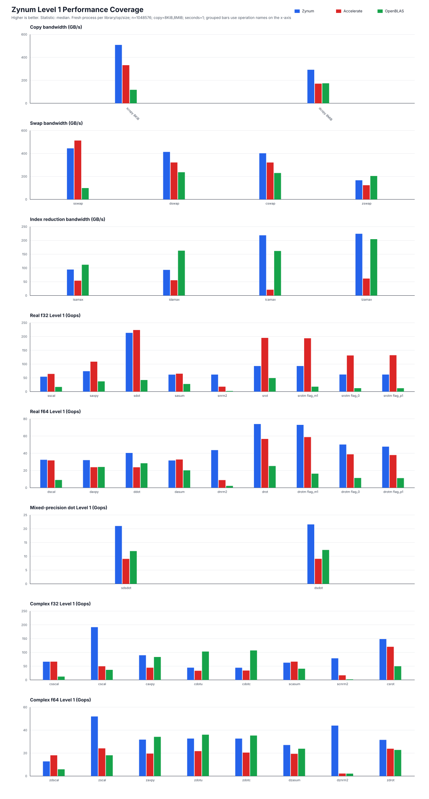
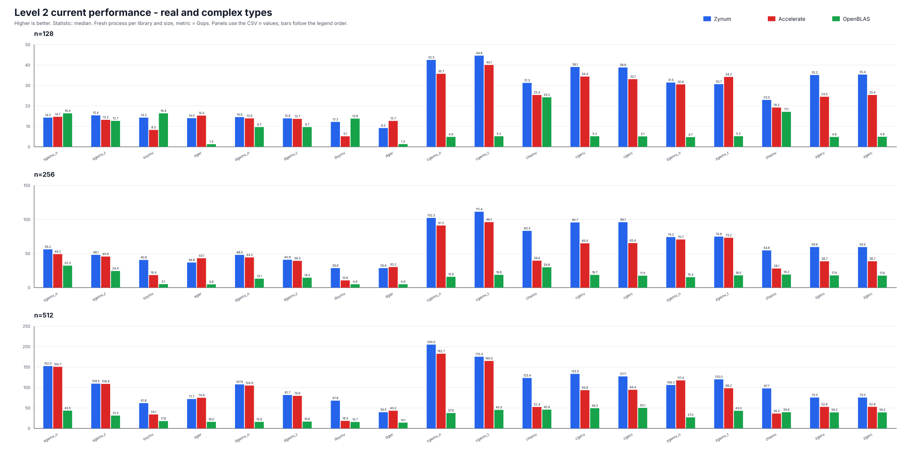
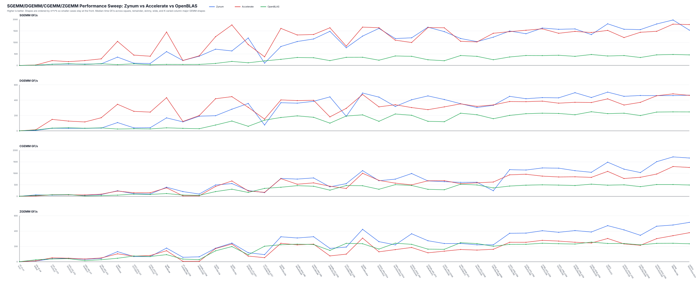

# Zynum

[](https://ziglang.org/)
[](#stability)
[](LICENSE)

Zynum is a Zig-native BLAS library with **Level 1–3 routines**, typed vector
and matrix views, and standard **CBLAS and Fortran ABI** entry points. It
supports real and complex arithmetic, portable fallbacks, and architecture-aware
kernels for AArch64 and x86_64.

## Quick start

Requires **Zig 0.16.x**. Build the shared and static libraries, C headers,
Fortran module, and pkg-config metadata:

```sh
zig build --release=fast -Ddispatch=dynamic
```

Artifacts are installed under `zig-out/`. Dynamic dispatch selects kernels
supported by the CPU and operating system. Use `-Dcpu=...` for an explicit
specialized build. Set `ZYNUM_MAXIMUM_THREADS` before the first call to cap
workers; otherwise Zynum uses the available CPU count as its ceiling.

For C and C++, include `<zynum/blas/cblas.h>` and link `zynum_blas`:

```sh
cc examples/cblas/dgemm.c -I zig-out/include -L zig-out/lib -lzynum_blas \
  -Wl,-rpath,zig-out/lib -o zig-out/dgemm
./zig-out/dgemm
```

Zig consumers import `zynum` or `zynum-blas`. The typed API exposes operations
such as `matrixMultiply`, `matrixVectorMultiply`, and `addScaledVector`.

See the [build and API guide](docs/development_and_usage.md),
[C/Fortran compatibility guide](docs/fortran_compatibility.md), and
[runnable examples](examples/README.md) for integration details.

## Performance

Apple M5, macOS 27.0, Zig 0.16.0; baseline-CPU dynamic-dispatch ReleaseFast
build. Charts compare **Zynum, Accelerate, and OpenBLAS** using six interleaved
fresh-process measurements. **Higher is better.** Zynum uses its default
thread policy; comparator thread caps are 10.



*Level 1: 46 real/complex vector cases, including 8 KiB and 8 MiB copies;
median process rates in Gops or GB/s as labeled.*



*Level 2: 60 cases at n=128, 256, 512; median process rates in GFLOP/s.
Timings include Python/ctypes call overhead.*



*GEMM: four scalar types across 42 NN column-major shapes; GFLOP/s from
median per-call timings. This covers GEMM, not every Level 3 operation.*

Performance varies by operation, shape, hardware, and thread policy.
See [methodology, data, and reproduction commands](docs/performance/README.md)
for the complete scope and measurement limitations.

## Documentation

| Topic | Guide |
| --- | --- |
| Build, install, and APIs | [User guide](docs/users/README.md) |
| Design and runtime dispatch | [Architecture](docs/architecture.md) |
| Tests and contribution checks | [Contributor guide](docs/contributors/README.md) |
| Benchmarking and kernel design | [Performance guide](docs/performance/README.md) |
| Support and security | [Support](SUPPORT.md) · [Security](SECURITY.md) |

## Stability

Zynum is **0.0.1-beta**. The BLAS module is available for evaluation and
integration; Zig API names, dispatch policy, and internal layout may change.
Other numerical modules are [planned](docs/roadmap.md).

## License

[LGPL-3.0-or-later](LICENSE). [COPYING](COPYING) contains the incorporated
GPL v3 terms; both license files accompany distributions.
