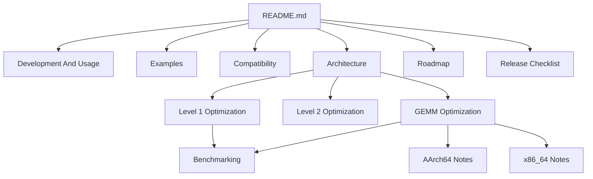

# Zynum Documentation

Welcome to the Zynum documentation portal.

**Repository:** <https://github.com/kaix-huang/Zynum>

**Current release line:** `0.1.x` development

**Current shipping module:** Zynum BLAS (`zynum-blas`)

Zynum is a Zig-native numerical runtime project. The beta release focuses on a
full BLAS Level 1-3 implementation with typed Zig vector/matrix views,
C/CBLAS/Fortran ABI compatibility, generated headers/modules, correctness tests,
examples, benchmarks, and selected architecture-aware GEMM optimization work.

The documentation is organized so users can start quickly, while contributors can
dig into ABI rules, dispatch policy, and benchmark methodology without guessing
where a decision belongs.

## Start Here

| Goal | Read |
| --- | --- |
| Understand the project in five minutes | `../README.md` |
| Build and use Zynum from Zig | `development_and_usage.md` |
| Call Zynum from C, C++, or Fortran | `fortran_compatibility.md` |
| Run examples | `../examples/README.md` |
| Understand source layout and module boundaries | `architecture.md` |
| Work on Level 1 kernels or dispatch | `common/level1_optimization_notes.md`, `common/benchmarking.md` |
| Work on Level 2 kernels or dispatch | `common/level2_optimization_notes.md`, `common/benchmarking.md` |
| Work on GEMM kernels or dispatch | `common/gemm_optimization_notes.md`, `common/benchmarking.md` |
| Prepare a GitHub release | `open_source_release_checklist.md` |
| See what comes after BLAS | `roadmap.md` |

## Documentation Map

## Core Guides

- `development_and_usage.md` — local setup, Zig package dependency examples,
  typed vector/matrix views, aliasing rules, workspace APIs, runtime controls,
  and extension workflow.
- `architecture.md` — module boundaries, source ownership, public API layering,
  ABI export roots, generated compatibility files, GEMM dispatch, and naming
  rules.
- `fortran_compatibility.md` — generated CBLAS/Fortran headers, Fortran 2003
  module usage, classic BLAS symbols, ABI integer width notes, and complex value
  caveats.
- `../examples/README.md` — runnable Zig, C/CBLAS, and Fortran matrix
  multiplication examples.
- `roadmap.md` — `0.1.x` BLAS completion/performance goals, beta line
  priorities, future modules, and the path toward a stable 1.0 contract.
- `open_source_release_checklist.md` — repository hygiene, validation commands,
  compatibility review, benchmark evidence, and GitHub settings.

## Performance And Kernel Work

- `common/benchmarking.md` — benchmark methodology, environment variables,
  comparator-library setup, isolated runs, outlier handling, and regression
  criteria.
- `common/level1_optimization_notes.md` — Level 1 engineering notes for copy,
  real/complex scalar vector loops, ABI correctness, parallel thresholds,
  focused probes, and grouped bar chart reports.
- `common/level2_optimization_notes.md` — Level 2 engineering notes for GEMV,
  SYMV, GER dispatch gates, rejected experiments, and fresh-process comparator
  probes.
- `common/gemm_optimization_notes.md` — cross-platform GEMM implementation
  principles: packing, dispatch, task splitting, threading, tail handling, and
  evidence requirements.
- `common/zig_0_16_std_io_threading.md` — Zig 0.16 `std.Io` and threading notes
  for GEMM workers plus selected Level 1/2 low-latency helper paths.
- `aarch64/gemm_aarch64_optimization_notes.md` — AArch64 ASIMD, SVE2, SME, and
  Apple-specific tuning notes.
- `x86_64/gemm_x86_64_optimization_notes.md` — x86_64 SSE, AVX, AVX2, AVX512,
  and MKL/OpenBLAS comparison notes.

## Common Tasks

| Task | Command or entry point |
| --- | --- |
| Run correctness tests | `zig build test --summary failures` |
| Build library and installed headers | `zig build --summary failures` |
| Regenerate C/Fortran compatibility files | `zig build generate-headers --summary failures` |
| Check formatting | `zig fmt --check build.zig build.zig.zon src test bench examples tools` |
| Run the Zig matrix example | `zig build --build-file examples/zig/build.zig run` |
| Run C/Fortran examples | See `../examples/README.md` |
| Run a quick benchmark | `zig build bench --release=fast -- --size 1024 --reps 10` |
| Run a GEMM sweep | `zig build bench-gemm-sweep --release=fast -- --reps 30` |
| Run a Level 1/2 sweep | `zig build bench-level12-sweep --release=fast -- --size 1024 --reps 60` |
| Plot a GEMM sweep | `python3 bench/tools/plot_gemm_sweep.py zig-out/gemm_sweep.csv zig-out/gemm_sweep.svg` |
| Plot a Level 1 report | `python3 bench/tools/plot_level1_report.py zig-out/level1_final_report.csv --bars-svg zig-out/level1_final_bars.svg --ratio-svg zig-out/level1_final_ratio.svg` |
| Refresh README performance charts | Follow `common/benchmarking.md#readme-performance-charts` |
| Prepare a public release | Review `open_source_release_checklist.md` |

## Contributor Paths

| Change type | Read first | Must update |
| --- | --- | --- |
| Public Zig API | `development_and_usage.md`, `architecture.md` | Tests, README/docs, changelog if user-visible |
| BLAS ABI export | `fortran_compatibility.md`, `architecture.md` | ABI tests, generated headers, export counts |
| Level 1 kernel | `common/level1_optimization_notes.md`, `common/benchmarking.md` | Correctness tests, ABI tests for complex scalars, focused report CSV/SVG |
| GEMM kernel | `common/gemm_optimization_notes.md`, architecture-specific notes | Correctness tests, descriptor/tuning notes, benchmarks |
| Benchmark claim | `common/benchmarking.md` | Commands, environment, CSV path, target/CPU details |
| New numerical module | `architecture.md`, `roadmap.md` | New source root, tests, docs, package surface |
| Release prep | `open_source_release_checklist.md` | Validation, GitHub settings, release notes |

## Documentation Rules

- Public documentation should be English.
- Prefer concrete commands, target details, and compatibility notes over broad
  claims.
- Keep performance claims tied to reproducible evidence.
- Mark beta/experimental features explicitly.
- Keep generated CSV and SVG files out of source control unless they are curated
  documentation assets under `docs/assets/`.
- Keep local machine instructions, raw sampling traces, disassembly dumps,
  profiler output, benchmark CSVs, temporary probe binaries, and uncurated plots
  out of the public tree. They may be referenced as local evidence paths in
  optimization notes, but the repository should track only source, tests,
  scripts, docs, generated compatibility headers/modules, and curated README
  chart assets.

## Public Artifact Boundary

Track source files, tests, examples, generated compatibility headers/modules,
benchmark tools, documentation, and the curated chart SVGs displayed by the
README. Do not track `zig-out/`, `.zig-cache/`, Python caches, `.DS_Store`, raw
CSV reports, profiler captures, LLDB transcripts, local agent instructions, or
machine-specific setup notes. Put local-only rules in `.git/info/exclude`
rather than in committed docs.

## Stability Notes

Zynum `0.0.1-beta` is ready for public evaluation, experiments, and integration
work, but it is not a stable 1.0 API contract. Standard BLAS ABI compatibility is
a project goal; Zig API names, package layout, dispatch thresholds, runtime
switches, and benchmark output formats may still change during the beta line.
